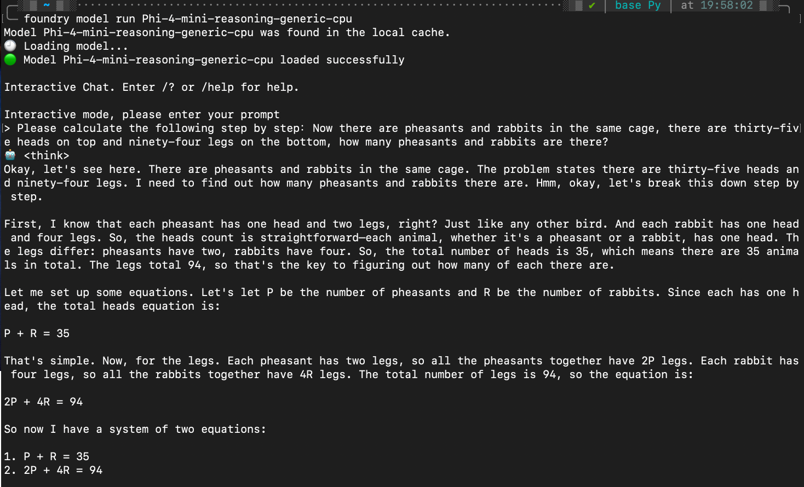

## Getting Started with Phi-Family Models in Foundry Local

### Introduction to Foundry Local

Foundry Local is a powerful on-device AI inference solution that brings enterprise-grade AI capabilities directly to your local hardware. This tutorial will guide you through setting up and using Phi-Family models with Foundry Local, offering you complete control over your AI workloads while maintaining privacy and reducing costs.

Foundry Local provides performance, privacy, customization, and cost advantages by running AI models locally on your device. It integrates seamlessly into your existing workflows and applications through an intuitive CLI, SDK, and REST API.


### Why Choose Foundry Local?

Understanding the benefits of Foundry Local will help you make informed decisions about your AI deployment strategy:

- **On-Device Inference:** Run models locally on your own hardware, reducing your costs while keeping all your data on your device.

- **Model Customization:** Select from preset models or use your own to meet specific requirements and use cases.

- **Cost Efficiency:** Eliminate recurring cloud service costs by using your existing hardware, making AI more accessible.

- **Seamless Integration:** Connect with your applications through an SDK, API endpoints, or the CLI, with easy scaling to Azure AI Foundry as your needs grow.

> **Getting Started Note:** This tutorial focuses on using Foundry Local through CLI and SDK interfaces. You'll learn both approaches to help you choose the best method for your use case.

## Part 1: Setting Up Foundry Local CLI

### Step 1: Installation

The Foundry Local CLI is your gateway to managing and running AI models locally. Let's start by installing it on your system.

**Supported Platforms:** Windows and macOS

For detailed installation instructions, please refer to the [official Foundry Local documentation](https://github.com/microsoft/Foundry-Local/blob/main/README.md).

### Step 2: Exploring Available Models

Once you have Foundry Local CLI installed, you can discover what models are available for your use case. This command will show you all supported models:


```bash
foundry model list
```

### Step 3: Understanding Phi Family Models

The Phi Family offers a range of models optimized for different use cases and hardware configurations. Here are the Phi models available in Foundry Local:

**Available Phi Models:** 

- **phi-3.5-mini** - Compact model for basic tasks
- **phi-3-mini-128k** - Extended context version for longer conversations
- **phi-3-mini-4k** - Standard context model for general use
- **phi-4** - Advanced model with improved capabilities
- **phi-4-mini** - Lightweight version of Phi-4
- **phi-4-mini-reasoning** - Specialized for complex reasoning tasks

> **Hardware Compatibility:** Each model can be configured for different hardware acceleration (CPU, GPU) depending on your system capabilities.

### Step 4: Running Your First Phi Model

Let's start with a practical example. We'll run the `phi-4-mini-reasoning` model, which excels at solving complex problems step-by-step.


**Command to run the model:**

```bash
foundry model run Phi-4-mini-reasoning-generic-cpu
```

> **First-Time Setup:** When running a model for the first time, Foundry Local will automatically download it to your local device. Download time varies depending on your network speed, so please be patient during the initial setup.

### Step 5: Testing the Model with a Real Problem

Now let's test our model with a classic logic problem to see how it performs step-by-step reasoning:

**Example Problem:**

```txt
Please calculate the following step by step: Now there are pheasants and rabbits in the same cage, there are thirty-five heads on top and ninety-four legs on the bottom, how many pheasants and rabbits are there?
```

**Expected Behavior:** The model should break down this problem into logical steps, using the fact that pheasants have 2 legs and rabbits have 4 legs to solve the system of equations.

**Results:**



## Part 2: Building Applications with Foundry Local SDK

### Why Use the SDK?

While the CLI is perfect for testing and quick interactions, the SDK enables you to integrate Foundry Local into your applications programmatically. This opens up possibilities for:

- Building custom AI-powered applications
- Creating automated workflows
- Integrating AI capabilities into existing systems
- Developing chatbots and interactive tools

### Supported Programming Languages

Foundry Local provides SDK support for multiple programming languages to fit your development preferences:

**📦 Available SDKs:**

- **C# (.NET):** [SDK Documentation & Examples](https://github.com/microsoft/Foundry-Local/tree/main/sdk/cs)
- **Python:** [SDK Documentation & Examples](https://github.com/microsoft/Foundry-Local/tree/main/sdk/python)
- **JavaScript:** [SDK Documentation & Examples](https://github.com/microsoft/Foundry-Local/tree/main/sdk/js)
- **Rust:** [SDK Documentation & Examples](https://github.com/microsoft/Foundry-Local/tree/main/sdk/rust)

### Next Steps

1. **Choose your preferred SDK** based on your development environment
2. **Follow the SDK-specific documentation** for detailed implementation guides
3. **Start with simple examples** before building complex applications
4. **Explore the sample code** provided in each SDK repository

## Conclusion

You've now learned how to:
- ✅ Install and set up Foundry Local CLI
- ✅ Discover and run Phi Family models
- ✅ Test models with real-world problems
- ✅ Understand SDK options for application development

Foundry Local provides a powerful foundation for bringing AI capabilities directly to your local environment, giving you control over performance, privacy, and costs while maintaining the flexibility to scale to cloud solutions when needed.


